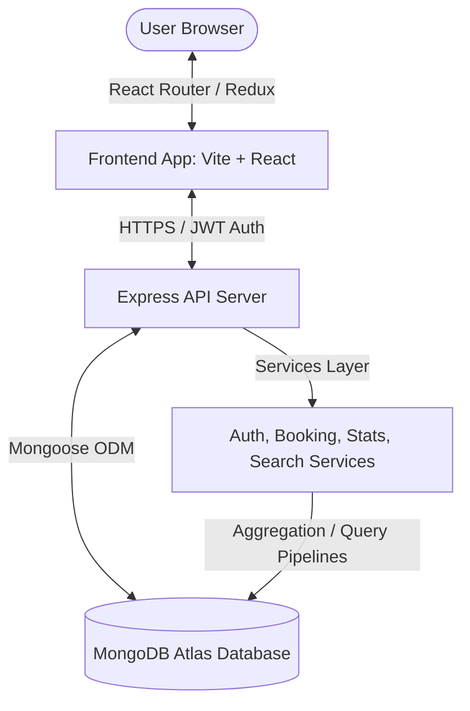

# 🚗 RideOps: Premium Full-Stack Fleet Management System

A high-performance, production-grade full-stack platform for managing, analyzing, and visualizing ride-hailing vehicle booking data. Designed around a real-world dataset of **18,289 vehicle booking records** from Bangalore, India, **RideOps** integrates a robust RESTful API backend with a state-of-the-art interactive administration dashboard.

---

<p align="center">
  
  
  
  
  
  
  
</p>

---

## 📋 Table of Contents

- [🌌 System Architecture](#-system-architecture)
- [✨ Key Features](#-key-features)
  - [Frontend Console (Client)](#frontend-console-client)
  - [Backend REST API (Server)](#backend-rest-api-server)
- [🛠️ Tech Stack](#-tech-stack)
- [📁 Project Structure](#-project-structure)
- [🚀 Getting Started](#-getting-started)
  - [Prerequisites](#prerequisites)
  - [1. Backend Setup](#1-backend-setup)
  - [2. Frontend Setup](#2-frontend-setup)
- [📊 Dataset Information](#-dataset-information)
- [🔒 Security & Middleware](#-security--middleware)
- [⚡ Scripts & Command Reference](#-scripts--command-reference)
- [📖 API Reference & Postman](#-api-reference--postman)

---

## 🌌 System Architecture

RideOps is built with a modern decoupled architecture:
1. **Frontend Console (Vite + React 19 + Redux Toolkit)**: A responsive Single Page Application (SPA) utilizing lazy loading, component-driven layouts, and a centralized store for state.
2. **Backend API (Node.js + Express 5 + MongoDB/Mongoose)**: A structured REST API utilizing the **MVC + Service Layer** pattern. Services encapsulate business logic and database queries, controllers handle request-response cycles, and middlewares manage security, logging, and validations.



---

## ✨ Key Features

### Frontend Console (Client)
*   📊 **Interactive Dashboard**: Visualizes critical key performance indicators (KPIs) like total revenue, ride success rate, and active bookings with custom micro-animations.
*   📈 **Rich Analytics Dashboard**: Advanced data visualization using `recharts`, breaking down payment methods, customer distributions, and vehicle-specific revenue trends.
*   🔍 **Advanced Booking Directory**: Search, filter, and sort bookings through complex criteria utilizing cursor-based server-side pagination for optimal performance.
*   🛡️ **Role-Based Views**: Automatic UI adjustments based on user privileges (e.g., admin-only create/edit actions and user-management tables).
*   ⚖️ **Side-by-Side Comparison**: Multi-booking validator allowing administrators to compare two rides side-by-side.
*   🎨 **Premium Styling**: Glassmorphic elements, modern gradients, Outfit typography, and curated colors (dark mode styling).

### Backend REST API (Server)
*   ⚡ **High-Throughput Seeder**: Seeds and sanitizes **18,289 records** in optimized batches.
*   🔒 **JWT Auth & Role-Based RBAC**: State-controlled user accounts with hashed passwords (`bcryptjs`) and scoped API endpoints (User vs. Admin).
*   📈 **MongoDB Aggregation Pipelines**: Built-in endpoints utilizing multi-stage aggregations (`$group`, `$match`, `$sort`, `$project`) to return deep statistical insights in milliseconds.
*   🤖 **AI Summary API**: Auto-computes analytics, anomalies, and statistics, outputting synthesized executive summaries.
*   🚦 **Tiered Rate Limiter**: Independent request caps for auth, searching, and general routes to prevent denial of service.
*   🧪 **Test Suite**: Automated API validation suite testing over 35 unique cases including CRUD, authentication bounds, and aggregation endpoints.

---

## 🛠️ Tech Stack

### Frontend
*   **Vite**: Next-generation frontend tooling.
*   **React 19**: Modern UI component architecture.
*   **Redux Toolkit**: Predictable state management container.
*   **Recharts**: Composable declarative charting library.
*   **Formik & Yup**: Robust form management and schema-based client validation.
*   **Lucide React**: Clean and consistent vector icons.

### Backend
*   **Node.js & Express.js (v5)**: High-performance asynchronous backend server.
*   **MongoDB & Mongoose (v9)**: Schema-driven ODM modeling document collections.
*   **JSON Web Tokens (JWT)**: Stateless secure token-based user sessions.
*   **bcryptjs**: Blowfish-based password hashing algorithm.
*   **express-rate-limit**: Middleware-level request rate control.

---

## 📁 Project Structure

```
Vehicle_Bookings/
├── Backend/
│   ├── config/            # MongoDB connection configuration
│   ├── controllers/       # HTTP Request/Response controllers (MVC)
│   ├── data/              # Raw Bangalore bookings JSON dataset (18,289 rows)
│   ├── middlewares/       # Security, JWT, Rate Limiting, validation schemas
│   ├── models/            # Database schema models (Booking, User)
│   ├── routes/            # Declared HTTP routes (Auth, Booking, Admin, Stats)
│   ├── scripts/           # Seeding, backups, and test suites
│   ├── services/          # Core Business Logic & Query pipelines
│   ├── utils/             # Helper utilities (Cursor pagination engine)
│   ├── .env.example       # Template environment variables
│   ├── package.json       # Backend configurations & dependencies
│   └── server.js          # App bootstrapper and server entrypoint
│
├── Frontend/
│   ├── public/            # Static assets
│   ├── src/
│   │   ├── components/    # Reusable UI elements & layouts
│   │   ├── hooks/         # Custom React hooks
│   │   ├── lib/           # Axios instance configuration
│   │   ├── pages/         # View structures (Dashboard, Analytics, Auth)
│   │   ├── state/         # State definitions
│   │   ├── store/         # Redux Toolkit global store and slices
│   │   ├── styles.css     # Premium stylesheet
│   │   ├── App.jsx        # Routing tree and layout shells
│   │   └── main.jsx       # Client entry mounting script
│   ├── vite.config.js     # Bundler configuration
│   └── package.json       # Client configurations & dependencies
│
└── README.md              # Documentation Mainframe
```

---

## 🚀 Getting Started

### Prerequisites
*   **Node.js** (v18 or higher)
*   **MongoDB** (running locally or MongoDB Atlas connection URI)

### 1. Backend Setup

First, navigate to the `Backend` directory and configure the API:

```bash
cd Backend
npm install
```

Copy the environment variables template and configure it:

```bash
cp .env.example .env
```

Open `.env` and fill in the required fields:
```env
PORT=5000
MONGO_URI=mongodb://localhost:27017/vehicle_bookings
JWT_SECRET=your_super_secret_jwt_key_here
NODE_ENV=development
```

Next, seed your MongoDB database with the real-world dataset (18,289 records):

```bash
npm run seed
```

Run the automated test suite to ensure the backend is fully operational:

```bash
npm test
```

Start the API server in development mode:

```bash
npm run dev
```

The API will now be listening at `http://localhost:5000`.

---

### 2. Frontend Setup

Open a new terminal window, navigate to the `Frontend` directory, and install dependencies:

```bash
cd Frontend
npm install
```

Create a `.env` file in the `Frontend/` folder using the `.env.example` file:
```env
VITE_API_URL=http://localhost:5000/api/v1
```

Launch the Vite development server:

```bash
npm run dev
```

The client will be running at `http://localhost:5173`. Open this URL in your browser to interact with the RideOps Fleet Console!

---

## 📊 Dataset Information

RideOps processes an anonymized dataset comprising **18,289 bookings** in Bangalore, India.

| Attribute | Data Type | Description | Example |
| :--- | :--- | :--- | :--- |
| `bookingId` | String | Unique alpha-numeric identifier | `CNR7153255142` |
| `date` | Date | Day the reservation was requested | `2026-06-21` |
| `time` | String | Time of booking placement | `12:27:04` |
| `bookingStatus` | String | Current status of the ride | `Success`, `Canceled by Driver` |
| `vehicleType` | String | Type of class chosen | `Prime Sedan`, `eBike`, `Auto` |
| `pickupLocation` | String | Initial passenger pick up point | `Indiranagar, Bangalore` |
| `dropLocation` | String | Intended destination | `Whitefield, Bangalore` |
| `bookingValue` | Number | Ride cost in Indian Rupees (INR) | `350` |
| `rideDistance` | Number | Measured length in kilometers | `12.5` |
| `paymentMethod` | String | Billing type | `UPI`, `Cash`, `Credit Card` |
| `driverRatings` | Number | Feedback scale (1.0 to 5.0) | `4.8` |

---

## 🔒 Security & Middleware

RideOps implements industry-standard safety practices at every API boundary:

*   **Bcrypt Password Cryptography**: User passwords are encrypted with a work factor salt before being stored in the database.
*   **JWT Stateless Handshakes**: Signed JWTs are used for identity verification. Tokens contain role scopes (`user` or `admin`) that are enforced using custom role verification middlewares.
*   **Tiered Limit Control**:
    *   `Auth Routes`: Max 5 login/registration requests per 15 minutes.
    *   `Search Routes`: Max 30 queries per minute.
    *   `Admin/Data Operations`: Max 20 write queries per minute.
    *   `General Public Endpoints`: Max 100 requests per minute.
*   **Cross-Origin Configuration (CORS)**: Restricts accessibility from unauthorized domains.

---

## ⚡ Scripts & Command Reference

### Backend Commands (`/Backend`)

*   `npm start`: Runs the server in production mode.
*   `npm run dev`: Runs the API server under node monitoring.
*   `npm run seed`: Clears the current bookings collection and uploads the dataset.
*   `npm test`: Launches the 35 API validation test suite.

### Frontend Commands (`/Frontend`)

*   `npm run dev`: Boots the local Vite development server.
*   `npm run build`: Bundles the React assets into highly optimized, minified production files.
*   `npm run preview`: Statically serves the built `dist` folder.
*   `npm run lint`: Verifies static styling rules and imports.

---

## 📖 API Reference & Postman

A comprehensive list of the **117+ backend routes** can be found in the [Backend README.md](file:///d:/Vehicle_Bookings/Backend/README.md) file. 

For interactive API testing, you can import the preconfigured **Postman Workspace**:
👉 **[Postman Documentation Link](https://documenter.getpostman.com/view/50841281/2sBXwmRDbN)**

---

<p align="center">
  Built with ❤️ by <a href="https://github.com/AnshPatel191207">Ansh Patel</a>
</p>
